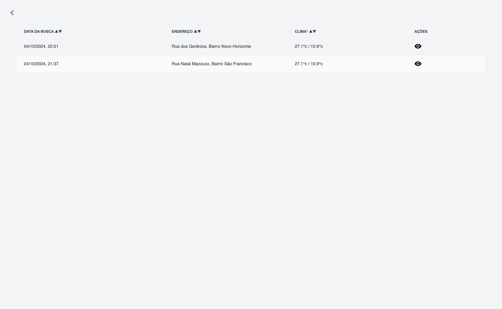

# Klab Interview Test

### This project is a challenge for a job vacancy.

## Preview of the application:

// Preview site: http://klab-inteview-test.com

> Open the images in a new tab for a better experience.

<p align="center">
  
  
  
  
</p>

## Folder Structure:

> i tried to follow the [nextjs folder structure](https://nextjs.org/docs/getting-started/project-structure) in this project.

```bash
...src/
      ├── api/
      │   ├── index.ts
      │   └── sources/
      │       ├── accuWeather.ts
      │       └── viaCep.ts
      ├── app/
      │   └── [locale]/
      │       ├── historic/
      │       ├── layout.tsx
      │       ├── page.tsx
      │       └── result
      ├── assets/
      ├── components/
      ├── helpers/
      ├── messages/
      ├── middleware.ts
      ├── redux/
      ├── styles/
      └── types/
```

## Features:

- i18n
- e2e tests with crypress
- ci/cd pipeline with vercel connection
- dockerized

## Project setup

To set up the project, follow these steps:

1. Clone the repository:

```bash
  git clone https://github.com/vmwavie/klab-desafio-react.git
```

2. Navigate to the project directory:

```bash
cd klab-desafio-react
```

3. Change your nodejs version to 22 using [NVM](https://github.com/nvm-sh/nvm)

```bash
nvm install 22 && nvm use 22
```

4. Install the dependencies:

```bash
npm install
```

5. Set your apyKey on `cypress.config.js`:

```js
import { defineConfig } from 'cypress';

module.exports = defineConfig({
  viewportHeight: 1080,
  viewportWidth: 1920,
  e2e: {
    baseUrl: 'http://localhost:3000/pt-br',
    supportFile: 'cypress/support/e2e.ts',
  },
  env: {
    API_KEY_ACCUWEATHER: 'lNG8O4GqNsonmBaUmGMkQSr0Gn8ONH5F', // your api key example
  },
});
```

7. Set your apiKey on `src/api/sources/accuWeather.ts`

```js
const API_KEY: string = 'lNG8O4GqNsonmBaUmGMkQSr0Gn8ONH5F'; // your api key example
```

## Lighthouse tests:

> I conducted tests using Lighthouse, and 100% of the site has metrics at 100%, except for performance, which at times is between 80-100.

<p align="center">
  
</p>

## Available scripts

To run various tasks, use the following npm scripts:

- `npm run dev`: Starts the development server for your NextJS application.
- `npm run build`: Compiles your Nextjs application for production.
- `npm run test:e2e`: Runs e2e tests for your Nextjs application.
- `npm run lint`: Runs ESLint to check your code for potential errors and stylistic issues.
- `docker compose up`: Builds and runs the application using Docker Compose. The application will be accessible at `http://localhost:3000`.
  I hope this improved documentation helps you understand and contribute to the project!

## Disclamer:

> There are some issues I should improve in this project, but there won't be enough time. One of them would be to move the API communication part to a BFF (Backend for Frontend) which Next.js provides, or execute it server-side to hide my API key since I don't have control over CORS on the server side. Another issue is the marker within the maps, but as I used an API with which I have little knowledge, I couldn't make the correction in time. I had to use it because I encountered problems activating the free tier of Google Maps. There are other implementations I would have liked to include, such as [driverjs](https://driverjs.com/) for better UX, as well as WAF, Load Balancer, and New Relic, which I didn't have time to configure an EC2 for.
> <br /> <br />
> There are some details in this project, such as comments in functions. Although I follow ideologies like [docs-as-code](https://medium.com/@reinanhs/docs-as-code-um-guia-b%C3%A1sico-para-iniciantes-b65b1e63b53a), I still believe that for a much faster delivery, certain functions are better with their documentation. When hovering over the imported name, we know which parameters to pass and the return, as well as what that function does, without having to spend time reading it each time we use it. I've worked on large-scale projects, and this has always helped me a lot. I always try to write the best possible code, but I like to document to bring better agility and understanding to the team.

## Notes:

- This site was made using the Kanban methodology. You can follow the shared Kanban board on Trello by [click here](https://trello.com/invite/b/66fdc16593b5a323761fd0b3/ATTI5e64763a704373ef7945bfcaf94a7ff0CA7449B1/klab-desafio-tecnico).

- This site had its design done in Figma. Later, while I was creating the site, I had to make some small changes. To see the design in Figma [click here](https://www.figma.com/design/MtYzsEFYfKrocaqZqR2G8x/Untitled?node-id=10-5039&t=VSOLn2aFBAtpMZ9d-1)

## License:

    MIT License

    Copyright (c) 2022 Matheus Ferreira

    Permission is hereby granted, free of charge, to any person obtaining a copy
    of this software and associated documentation files (the "Software"), to deal
    in the Software without restriction, including without limitation the rights
    to use, copy, modify, merge, publish, distribute, sublicense, and/or sell
    copies of the Software, and to permit persons to whom the Software is
    furnished to do so, subject to the following conditions:

    The above copyright notice and this permission notice shall be included in all
    copies or substantial portions of the Software.

    THE SOFTWARE IS PROVIDED "AS IS", WITHOUT WARRANTY OF ANY KIND, EXPRESS OR
    IMPLIED, INCLUDING BUT NOT LIMITED TO THE WARRANTIES OF MERCHANTABILITY,
    FITNESS FOR A PARTICULAR PURPOSE AND NONINFRINGEMENT. IN NO EVENT SHALL THE
    AUTHORS OR COPYRIGHT HOLDERS BE LIABLE FOR ANY CLAIM, DAMAGES OR OTHER
    LIABILITY, WHETHER IN AN ACTION OF CONTRACT, TORT OR OTHERWISE, ARISING FROM,
    OUT OF OR IN CONNECTION WITH THE SOFTWARE OR THE USE OR OTHER DEALINGS IN THE
    SOFTWARE.
